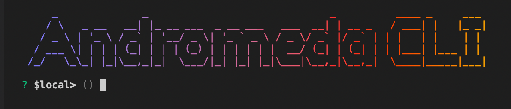

# Introduction


The CLI is still in beta phase. It may contain bugs and upgrades will probably be released weekly.


## Installation

To install the Andromeda CLI, run the following command:


Make sure you have npm installed.


```
npm install -g @andromedaprotocol/andromeda.js
```

Then run `andr`  to open the CLI:



### CLI Commands

Now that we have the CLI open, we can start exploring some of its functions which include:

* Generating Keys and managing wallets.
* Swap between chains with one command.
* Interact with the set chain (Deploy, instantiate, execute ...)
* Query using our GraphQL server.


The andromeda CLI is built to work with any of the chains that Andromeda is deployed on. This would remove the need for users to learn how to deploy contracts on each of the chains allowing them to use this CLI to interact with ADOs anywhere on the Cosmos ecosystem.&#x20;


### Deployed Chains

Andromeda is currently deployed on the following chains:

* Andromeda
* Juno
* Stargaze
* Terra

### Starting Exploring

We can start off by running `andr --help` to see what are the available commands.&#x20;

```
andr --help 
```

Or just:

```
help
```

You will get a list of available commands to use:

| Command     | Description                         |
| ----------- | ----------------------------------- |
| **ado**     | Query and execute on an ADO         |
| **chain**   | Manage Chain Config                 |
| **clear**   | Clears the terminal                 |
| **exit**    | Exits the CLI                       |
| **help**    | Lists all valid commands            |
| **hubble**  | Query using the Hubble service      |
| **reload**  | Prints previous commands            |
| **wallets** | Manage wallets                      |
| **wasm**    | Send CosmWasm messages to the chain |


It is important to note that the CLI has been designed to promt the user for the required fields in each command. This means that it is sufficient to write the command without the fields and the CLI will prompt you to fill in the inputs one by one instead of throwing an error.&#x20;

