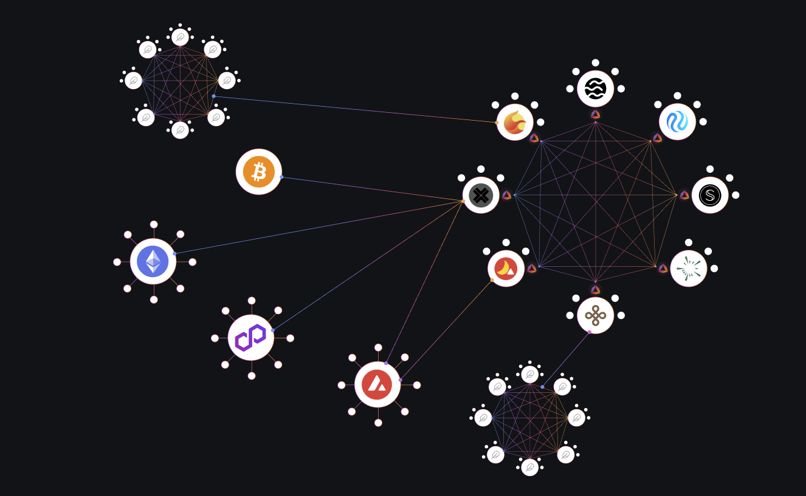

# Introduction to AndromedaOS

### Mission

**Andromeda** **Protocol** is a rapid development framework and a next-generation user interface that brings an Easier, Better, and Faster capability to Web 3.0, and the blockchain industry.



#### What is a blockchain operating system? 

In short, a blockchain operating system provides an environment filled with ready to use tooling, common interfaces for applications and features familiar to modern computer users. As Andromeda is the first true operating system designed to run on distributed computing frameworks, the details are quite technical.

AndromedaOS, or _aOS_ for short, is comprised of several interoperating systems that work together to bring clarity and ease of use to the user. It's important to understand the basic concepts and architecture of the system to develop.

A quick description of each of the components that make up the aOS:

* ​[Andromeda Digital Objects](./#andromeda-digital-objects-ados) - the building blocks of the system
* [​Andromeda Apps](andromeda-digital-objects/app-v1.0.1.md) - advanced functionality built with ADOs
* ​[aOS Kernel](platform-and-framework/andromeda-messaging-protocol/kernel.md) - the system for enforcing and coordinating the different systems
* ​[aOS File System](platform-and-framework/andromeda-messaging-protocol/virtual-file-system.md) - common namespace for referencing ADOs, services, network, etc
* ​[aOS Economics](platform-and-framework/andromeda-messaging-protocol/economics-engine.md) - developer and creator incentives

It's important to note that each of these systems exist 100% on-chain. All logic, interactions, objects, economics, etc. are deployed on-chain.

### Powered by the Cosmos Ecosystem 

The power and performance of the Rust/CosmWasm combo is what allowed this breakthrough in interoperability and complexity.

#### Infinite Reach Through IBC


IBC functionality is being slowly introduced into the system. Not all features mentioned below are currently available.&#x20;


Just like an operating system that can be seamlessly installed on any device, the AndromedaOS transcends limitations tied to the Andromeda chain. It is designed for universal compatibility and can be effortlessly deployed on any chain within the expansive Cosmos ecosystem.&#x20;

The operating system can be employed for local development on the chain, yet its true potential shines through Inter-Blockchain Communication (IBC). This capability allows the creation of Apps that extend seamlessly across multiple interconnected chains.

Here is a visual representation of how this system is connected.

<figure><figcaption>
Andromeda Connecting the Cosmos
</figcaption></figure>

As we can see, each of the Cosmos chains has AndromedaOS deployed . Since AndromedaOS can communicate using IBC, then users can build Applications that span accross many chains taking advantage of all the benefits that come along.

For example, a user can build an NFT collection on Stargaze selling the NFTs using one of our ADOs and then using a splitter to send part of the funds to Terra to leverage some protocol and another part to Injective to leverage some functionality there. The user's imagination is the only limit to what can be built using the aOS. &#x20;

### What is the benefit of using aOS

* **For Projects:**

Before **Andromeda**, projects would need to hire a full development teams in order to  build their projects and custom smart contracts. Andromeda eliminates this need by providing a very large amount of custom smart contracts that upcoming projects can pick and chose from to achieve their desired utility. These projects can then use our **No-Code-Builder** to build their projects in a matter of minutes on any of the chains that Andromeda is deployed on.

* **For Developers:**

Developers can use our **Andromeda Logic Library** (ALL) which contains all our contracts to build from. Similar to how [**cw-plus**](https://github.com/CosmWasm/cw-plus) contracts are used as a base for production quality builds, the ALL will act as a base for all developers to create their own ADOs that use the superior interoperable system.&#x20;

As it stands, the ALL contains around 25 ADOs which is the tip of the iceberg. More and more ADOs are being added by the Andromeda team, and as we continue building, the ALL will eventually reach a state with thousands of ADOs where every use case imagined can be built using it.&#x20;

Furthermore, developers are incentivized for their contributions and the ADOs they create. This incentive system operates through our[ economic engine](platform-and-framework/andromeda-messaging-protocol/economics-engine.md), enabling developers to set custom fees on their ADOs when it is published. Users utilizing these ADOs pay these fees, which are then returned to the developer responsible for their creation.

* **For Chains:**

&#x20;AndromedaOS provides a whole suite of tooling that can be quickly installed on any chain in the Cosmos ecosystem. Installing the aOS would instantly give a chain and its users access to the following:&#x20;

1. A large number of production ready ADOs to be used.&#x20;
2. The best no-code-builder in Cosmos and perhaps the entire blockchain industry.
3. IBC capable applications.
4. An incredible all in one CLI that is easy to use and manage.
5. Exposure to the chain, as users on any chain that implements the aOS will be able to to see where aOS is also deployed and might consider building applications on said chain.

### Andromeda Tools 

Andromeda has built many tools for users to be able to deploy and interact with our ADOs and Apps the way they find easiest:

* **Andromeda No-Code-Builder:** The Andromeda no-code-builder is a easy to use interface on our web-app that allows users to build ADOs, Apps, and much more without having to write a single line of code.&#x20;
* **Andromeda CLI:** Since Andromeda is aiming to be launched on all cosmos chains, it would be inconvenient to have developers who want to develop using the ALL to learn every CLI of each chain in order to interact with our contracts. To solve this, we have built the Andromeda CLI that would allow you to interact with any of the chains that Andromeda is deployed on using the same format bypassing the need to learn the specific method for each of the chains. Make sure to check out our [CLI documentation ](broken-reference)to learn more.
* **GraphQL:** We have built custom GraphQL servers that fetch any information we require on ADOs and Apps. The GraphQL also keeps track of all ADOs created and the information on each. This would allow projects to keep track of their ADOs like no other project can, retrieving relevant information with ease.&#x20;
* **AndromedaJS:** Andromeda.js is a JavaScript SDK for writing applications that interact with ADOs on any of the blockchains that Andromeda is deployed on. More on the AndromedaJS can be found [here](https://docs.andromedaprotocol.io/andromeda.js/).
