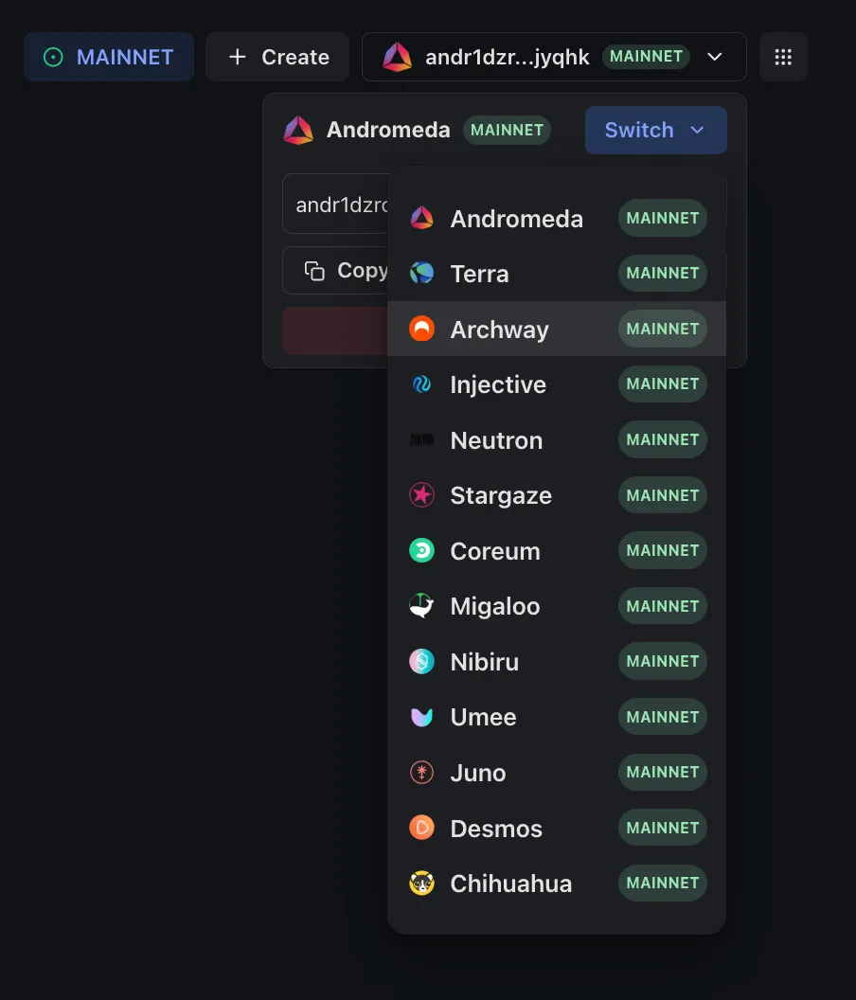

# Overview

Welcome to the Andromeda [Web Application](https://app.andromedaprotocol.io/)! This documentation serves as a comprehensive guide to help you understand, navigate, and utilize the full potential of our  web-app. Whether you're a seasoned developer, a curious enthusiast, or a passionate creator, our suite of tools empowers you to build, innovate, and thrive in the decentralized digital landscape.&#x20;

<figure><figcaption></figcaption></figure>

## **How Does it work?** 

Andromeda is built on a modular smart contract system powered by Andromeda Digital Objects (ADOs).

Each ADO is a purpose-built smart contract. One might handle vesting schedules, another manages auctions, and another acts as a token exchange. Together, these ADOs form the building blocks of any decentralized application on Andromeda.

In Andromeda, you create what we call an Andromeda App, your full-fledged web-3 application composed of one or more ADOs working in sync.

Within the Andromeda Web App, we refer to these ADOs as components. The builder lets you:

* Start a new app with just a few clicks
* Add and connect components (ADOs) based on the functionality you need
* Configure each component to match your use case
* Publish your app, which automatically initializes and deploys all components to the blockchain of your choice

## **What Can You Build?** 

With Andromeda aOS, the possibilities are endless. Think of ADOs like LEGO pieces.

Give ten people the same twenty blocks, and each one will build something completely different, a tower, a spaceship, a castle. ADOs work in the same way: each one serves a specific purpose (like handling auctions, vesting, token creation, or payments), but they’re designed to be combined and configured in many ways. ADOs can talk to each other, passing messages and executing logic across components within your app.

This means that you can create entirely unique decentralized applications just by selecting, connecting, and configuring the right pieces. No code required!

Here are just a **FEW** examples of what you can build on aOS today:

* **Payment System:** Need a seamless payment flow? Use the Splitter ADO to automatically distribute payments among multiple recipients.
* **NFT Marketplace:** Combine the Marketplace ADO with Auction ADO and Rates ADO to deploy a fully functional NFT marketplace in minutes.
* **Multisig Wallet:** Deploy a Multisig ADO for secure, shared asset management across multiple users.
* **Memecoin:** Launch your own viral token quickly
* **Staking/Vesting App:** Implement staking rewards or vesting schedules easily with the Staking ADO or Vesting ADO.
* **Escrow:** Create secure, trustless payment agreements with the Escrow ADO.
* **Token Exchange:** Create and launch your own token, then set up a marketplace to sell it directly to users.

## Where Can You Build?

Andromeda aOS is integrated with over 10 chains, giving you the flexibility to deploy your apps where they make the most sense for your project and audience.

<figure><figcaption></figcaption></figure>
