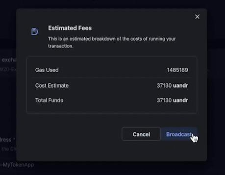

# CW20 Exchange


If unfamiliar with building Andromda Apps on the webapp, refer to "[Building Your First App](building-your-first-app.md)" section to learn the basics before proceeding with this guide.


In this guide, we will create a CW20 Exchange App to mint, sell, and manage CW20 tokens using the Andromeda Protocol’s web app.

***

### **Defining the App**

Before we begin building the App in the ADO Builder, let's define its features and functionality. We will assume the following:

* A project is looking to launch a CW20 token&#x20;
* The project is looking to sell this CW20 token in exchange for native uandr tokens


You can also sell the CW20 tokens in exchange for another CW20 of your choice, but in this example we will be using native tokens.


***

### **Defining the Components**

To create the app we described above, we need the following components inside the app:

* [CW20](https://docs.andromedaprotocol.io/andromeda/andromeda-digital-objects/cw20) component to launch and mint CW20 tokens to be sold
* [Exchange ADO](https://docs.andromedaprotocol.io/andromeda/andromeda-digital-objects/cw20-exchange) to enable the sale of the CW20 tokens to users

The workflow of the App can be described as the following:&#x20;

* Build the App with the required components and publish to chain
* Mint the CW20 tokens
* Start a sale on the CW20 tokens by sending them to the exchange component
* Purchase some of the CW20 tokens to test the app

***

## Let's get started

## **Building the App**

Open a new blank canvas in the ADO Builder and start by giving the App an appropriate name:&#x20;

The first component we need to add is the CW20 ADO. It will be used to create a CW20 token that we can put up for sale later on. As this is the first time we are using a CW20 token instead of the usual CW721, let us go though the fields that can be configured:

* **Token Name**: The name of the token. Choose any name that you want.&#x20;
* **Token Symbol**: The symbol of the tokens. Choose any symbol that you want (Between 3 and 12 characters).
* **Number of Decimals**: The number of decimals to assign for the token. We will be using 0 in this example. To learn more about decimals, check our documentation on [CW20](https://docs.andromedaprotocol.io/andromeda/andromeda-digital-objects/cw20#send).
* **Starting Balance**: Initial balances to assign to specific addresses. We will not add any in this example as we will be minting the CW20 tokens after publishing the app.
* **Marketing Info**: All the information about the token such as descriptions, logo, and URLs pointing to additional information about the project. We will not need to fill this information as this is just an example guide.
* **Mint**: An optional address to be assigned as a minter to the ADO along with a cap. If the minter is specified, then the minter address is the only address allowed to mint/create additional CW20 tokens other than the initial balances.&#x20;
* **Cap:** If a cap is specified, then the minter can only mint an amount of new tokens so that the total amount of CW20 tokens dont exceed the cap. For example, if the cap is 1000, and the initial balances contain 800 tokens, then the minter is allowed to mint 200 tokens still.  Omiting a minter means that no additional CW20 tokens other than the initial balances can ever be created.&#x20;

For this example, use your connected wallet address as the minter and there is no need for a cap.&#x20;


You can rename this ADO. For this guide we will use \`**cw20-token**\`. This name will be referenced later on.


<figure><figcaption></figcaption></figure>

Now that we have set up our CW20, it is time to add our CW20 exchange ADO. Add a new component and select the CW20 exchange from the list of ADOs. For the exchange we just need to specify one field:

* **Token Address**: A reference to the CW20 ADO that you are looking to sell tokens of. In our case, that is the CW20 we just set up before this. Using our [VFS naming](https://docs.andromedaprotocol.io/andromeda/platform-and-framework/andromeda-messaging-protocol/virtual-file-system) we can reference it by the assigned name. From the dropdown, choose the reference to the CW20 component.&#x20;


You can rename this ADO to be referenced by the new name.

You can also reference a CW20 by the contract address if it already exists.


&#x20;To publish the app, hit the "Publish" button. A transaction simulation, then gas estimate will appear. Broadcast:

  

Approve the transaction:

 

## Interacting with our App

### Minting the Tokens

Our app is now published on the Andromeda chain, and we can start interacting with it. First step will be minting some CW20 tokens to be sold in the exchange:

\- Go to your ASSETS page.

\- Locate and open the App that you just created.

\- Locate the CW20 component.

\- Click the 3 dots to reveal a dropdown menu containing the available execute messages.

\- From the dropdown menu, select “**Mint**.” &#x20;

.png>)

For our Mint message, we need to define the amount of tokens to mint and the address to receive these tokens. For this example, let us mint 10000 tokens. As for the **Recipient** of these tokens, we will use the our address. The exchange ADO only accepts tokens that are sent from the contract owner, which in our case will be our address:

Publish the message to the chain. In previous guides, we did not use many [queries](../../learning-the-basics/using-queries.md), so let us change that in this example by querying the amount of tokens the our address has and confirming that the mint was succesfull. To perform the query, we need to do the following:&#x20;

\- Go to your assets page.

\- Locate and open the App that you just created.

\- Locate the CW20 component.

\- Click the 3 lines "hamburger menu" to reveal a dropdown menu.

\- From the dropdown menu, select “Balance”

<figure><figcaption></figcaption></figure>

\- For the Address, specify the address of your App component, and press "Query":&#x20;

<figure><figcaption></figcaption></figure>

As we can see in the "Query Response" section, the balance is 10000 which is the amount we minted.

### Sending the Tokens to the Exchange

We have created the app, minted the tokens, and checked our balance. The last step will be sending the tokens to the exchange to be sold. Similar to sending NFTs to an auction or marketplace (As seen in [previous guides](nft-marketplace-app.md)), we want to send the tokens to the exchange and attach the sale parameters to it.&#x20;

Select the Send execute message from the list of messages available for the CW20 component. The fields here will be the following:

* &#x20;The contract address of the exchange ADO for the **Receiving Contract Address** as we are looking to send it the tokens.
* 10000 for the **Amount Being Sent** so we can sell all the tokens we minted.
* For supporting messages, select **CW20 Exchange** and a **StartSale** from the drop downs. This will expand the panel and allow us to set up the sale.&#x20;
* As an **Asset**, we had discussed that we want to sell the CW20s in exchange for native tokens. So select native and uandr as the denomination .


In case you are using another chain to build this app (Not Andromeda), specify the micro-denom of that chain and not uandr.


* 86400000 for duration to specify the duration of the sale as one day as **86400000 ms = 1day.**
* As **Exchange Rate**, I will use 10. This means 10uandr will buy a user 1 CW20. This can be set up to whatever the project owners want.
* Keep **Start Time** empty to start the sale immidiately.&#x20;
* Finally, the **Recipient** is the address that will receive the uandr funds that were used the buy the CW20 tokens. We want the proceeds of the sale to go to us, so specify your connected wallet address.&#x20;

<figure><figcaption></figcaption></figure>

After publishing the message to the chain, the sale is now live and users can use the exchange ADO to to buy the CW20s using uandr funds. As a last step, we will try buying some CW20 tokens and checking the results.&#x20;


You can query the balances of your address and the CW20-Exchange ADO. Your address should have 0 tokens and the exchange the 10000 as we sent all the tokens.


### Testing our App

To purchase some tokens, we will need to execute a message on the exchange component. From the list of execute messages, select the **Purchase** option:&#x20;

<figure><figcaption></figcaption></figure>

There is only one optional field for a **Purchase** message which is the recipient of the CW20 tokens. This allows a user to buy the CW20 tokens for another address. For this example we want to purchase for ourselves so we do not need to specify this as it defaults to the executing wallet:

<figure><figcaption></figcaption></figure>

### Attaching Funds to the Message

Since we are using native tokens to buy the CW20s, we need to attach the native uandr funds to the message before publishing. We can do that by selecting **Add Attachment** and choosing the **Add Fund** option. Let us buy 100 CW20 tokens. Based on our exchange rate, we would need to attach 1000uandr as each CW20 costs 10uandr:

<figure><figcaption></figcaption></figure>

Once added, a new panel will pop up were we can specify the type and amount of funds we want to attach:

<figure><figcaption></figcaption></figure>

Publish the message and let us take a look at our CW20 balance. We can use the same query we had used before, but this time we want the balance for our address (Your connected address) so specify that:

<figure><figcaption></figcaption></figure>

As you can see, my CW20 balance is now 100, the amount we purchsed and the uandr funds have been transferred to my address.&#x20;


If you want to try buying some of the CW20s from the sale and then checking the results, check our "[Using CLI to Interact with Apps](../using-cli-to-interact-with-apps.md)" section.

If you are interested in using queries on your App components, check out our [Using Queries ](../../learning-the-basics/using-queries.md)section to learn about that process.

