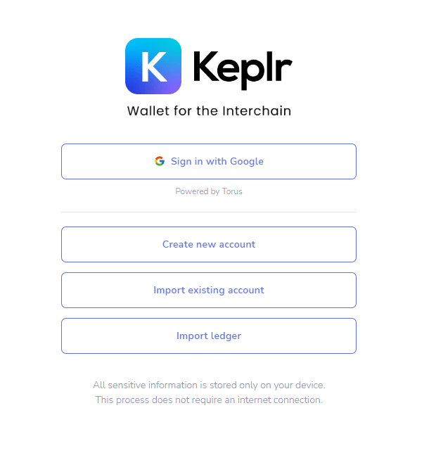
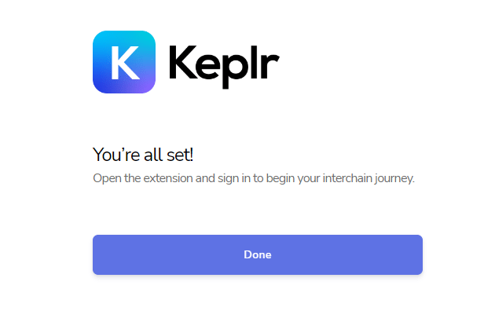

# Setting Up your Wallet

Andromeda uses Keplr integration with our web-app to easily connect your wallets and start building. This document will serve as a guide to connecting your Keplr wallet to our web-app if unfamiliar with the steps.


If you already have a Keplr wallet, you can directly go to the [Connecting to the Web App](setting-up-your-wallet.md#connecting-to-the-web-app) section.


### Downloading the Keplr Extension

First step we need to do is download the Keplr extension to our browser. You can download the extension from their site:


Keplr Official Website


Chose the approprate extension to download based on your browser:

<figure><figcaption>
Keplr Supported Browsers
</figcaption></figure>


Keplr only supprts Chrome and FireFox browsers.


### Create a Wallet

After downloading the extension, open it

<figure><figcaption></figcaption></figure>


If you already have an account, you can chose to import it. You will be prompted to add the account info and then your account will be connected.


Press “Create new account” to create a new keplr wallet. Choose a username and password for the account. Do not share the mnemonic with anyone and always save it in a safe place since it is the only way to recover your wallet.

You will be quickly prompted in the next page to enter the mnemonic that you have saved. Do so and select “Register”. Once you do you, the account should be setup:

<figure><figcaption></figcaption></figure>

After having installed and created your Keplr account, go to [https://address.andromedaprotocol.io/](https://address.andromedaprotocol.io/) to add an ANDR address to your Keplr wallet.

### Connecting to the Web-App

Now that you have the Keplr extension up and running, you still need to connect to the web-app. Go to   [https://app.andromedaprotocol.io/](https://app.andromedaprotocol.io/), then connect your wallet, select ANDR under 'select a chain', and agree to terms and conditions.
